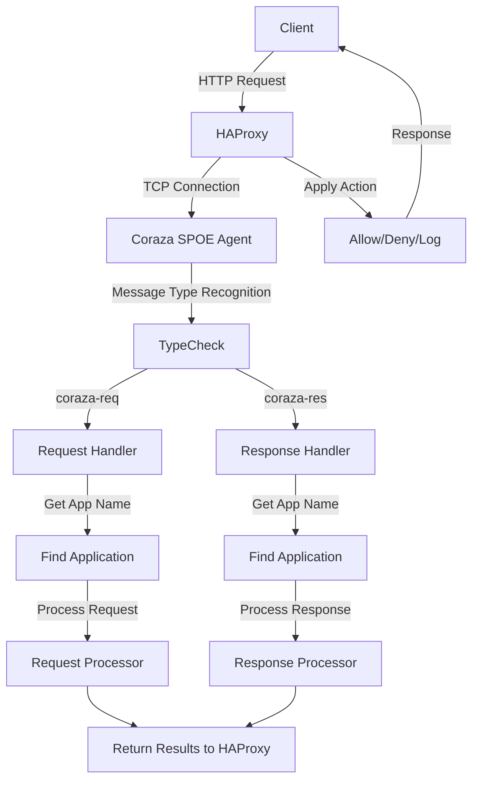

# RuiQi WAF

<div align="center">
  
  
  
  
</div>

<br>

A modern web application firewall (WAF) management system built on top of [HAProxy](https://www.haproxy.org/) and [OWASP Coraza WAF](https://github.com/corazawaf/coraza) with the [Coraza SPOA](https://github.com/corazawaf/coraza-spoa) integration. This system provides a comprehensive backend API for managing HAProxy configurations, Coraza WAF rules, and traffic inspection.

## 🌐 Click To Run

run the application in less than 30 seconds,default username: **admin**,default password: **admin123**

[](https://usw.sealos.io/?openapp=system-template%3FtemplateName%3DRuiqi-Waf)


## Core Architecture

Simple WAF implements a modular architecture with HAProxy at the front handling traffic and Coraza WAF providing security inspection through SPOE (Stream Processing Offload Engine):



### SPOE Communication Workflow

```
[HAProxy Request] → [internal.Agent.Serve(Listener)]
                          ↓
                   Create spop.Agent
                   agent := spop.Agent{
                       Handler: a,
                       BaseContext: a.Context,
                   }
                          ↓
                [spop.Agent.Serve(Listener)]
                          ↓
                   Accept new connections
                   nc, err := l.Accept()
                          ↓
                   Create protocol handler
                   p := newProtocolClient(ctx, nc, as, handler)
                          ↓
                   Start goroutine for connection
                   go func() {
                       p.Serve()
                   }()
                          ↓
                [protocolClient.Serve]
                   Process frames in connection
                          ↓
                [frameHandler processes Frame]
                   Dispatch based on frame type
                          ↓
                [onNotify handles messages]
                   Create message scanner and objects
                   Call Handler.HandleSPOE
                          ↓
                [internal.Agent.HandleSPOE processing]
                          ↓
                   Parse message type (coraza-req/coraza-res)
                          ↓
                   Get application name
                          ↓
                   Find Application
                          ↓
                   Execute message handler
                          ↓
                   Process return results
                          ↓
                [Return to HAProxy]
```

## Features

- **HAProxy Integration**

  - Full HAProxy lifecycle management (start, stop, restart)
  - Dynamic configuration generation
  - Real-time status monitoring

- **Coraza WAF Integration**

  - OWASP Core Rule Set (CRS) support
  - ModSecurity SecLang rule compatibility
  - Custom rule management
  - WAF engine lifecycle management

- **Advanced Security**

  - HTTP request inspection
  - HTTP response inspection
  - Real-time attack detection and prevention
  - RBAC user permission system

- **Monitoring and Logging**

  - WAF attack logs and analytics
  - Traffic statistics
  - Performance metrics

- **API-Driven Workflow**
  - RESTful API with Gin framework
  - Swagger/ReDoc API documentation
  - JWT authentication

## Prerequisites

- Go 1.24.1 or higher
- Node.js 23.10.0 and pnpm 10.6.5 (for frontend development)
- HAProxy 3.0 (for local development)
- MongoDB 6.0
- Docker and Docker Compose (for containerized deployment)

## Local Development

1. Clone the repository:

```bash
git clone https://github.com/HUAHUAI23/simple-waf.git
cd simple-waf
```

2. Setup the frontend development environment:

```bash
cd server/web
pnpm install
pnpm dev # For development mode with hot reload
# or
pnpm build # For production build
cd ../..
```

3. Configure backend environment:

```bash
cp server/.env.template server/.env
# Edit .env with your configurations
```

4. Run the Go backend service:

```bash
go work use ./coraza-spoa ./pkg ./server
cd server
go run main.go
```

The development server will start with:

- API server: `http://localhost:2333/api/v1`
- Swagger UI: `http://localhost:2333/swagger/index.html`
- ReDoc UI: `http://localhost:2333/redoc`
- Frontend: `http://localhost:2333/`

## Docker Deployment

1. Clone the repository:

```bash
git clone https://github.com/HUAHUAI23/simple-waf.git
cd simple-waf
```

2. Build the Docker image:

```bash
docker build -t simple-waf:latest .
```

3. Run as a standalone container:

```bash
docker run -p 2333:2333 -p 8080:8080 -p 443:443 -p 80:80 -p 9443:9443 -p 8404:8404 simple-waf:latest
```

4. Alternatively, use Docker Compose for a complete deployment with MongoDB:

```bash
# Edit docker-compose.yaml to configure environment variables if needed
docker-compose up -d
```

This will start both MongoDB and Simple WAF services with all required configurations.

## License

This project is licensed under the MIT License - see the LICENSE file for details.

## Acknowledgements

- [OWASP Coraza WAF](https://github.com/corazawaf/coraza)
- [Coraza SPOA](https://github.com/corazawaf/coraza-spoa)
- [HAProxy](https://www.haproxy.org/)
- [Go Gin Framework](https://github.com/gin-gonic/gin)
